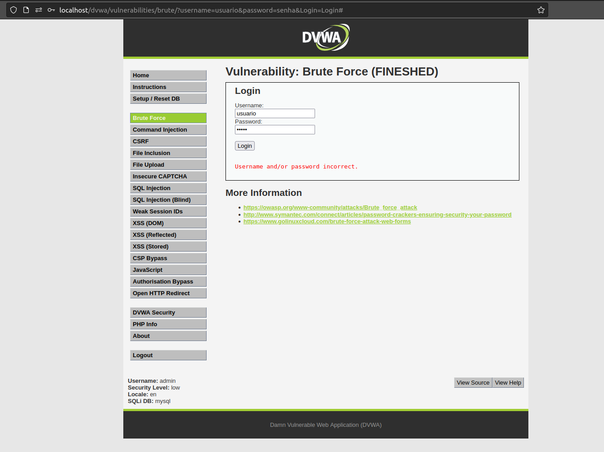

# DVWA - Brute force com Hydra/BurpSuite

## Sem Tokken

- Primeiro, vamos testar um login aleatório
    
    
    
- Perceba 2 coisas
- URL:
    - Aparentemente usa o método **GET** pois passa parâmetros na URL
    - Então vamos verificar se ele realmente usa esse método
        
        
        
    - Na tag `<form>` ele passa o `method` **GET**
- ERRO:
    - Ele envia uma frase de erro
- Cokkies
    - Para montar o comando, precisamos enviar os cookies do site, então para isso iremos usar `H=Cookie: <cookie>` após a palavra incorreta dentro do comando
    - Pegando Cookies pelo google
        - `F12` - `Application` - `Cookies`
            
            
            
    - Pegando Cookies pelo FireFox
        - `F12` - `Storage` - `Cookies`
            
            
            
    - **Entre um parâmetro e outro usa o `;`**
- Comando
    
    ```bash
    hydra -L wordlist/SecLists-master/Usernames/top-usernames-shortlist.txt -P wordlist/rockyou.txt 192.168.1.16 http-get-form "/dvwa/vulnerabilities/brute/:username=^USER^&password=^PASS^&Login=Login:incorrect:H=Cookie: security=low; PHPSESSID=eukt4lhs0dc02qr7fs5iq15i37"
    ```
    
    | Opção | Descrição |
    | --- | --- |
    | -L wordlist/SecLists-master/Usernames/top-usernames-shortlist.txt | Especifica o caminho para o arquivo contendo nomes de usuário. |
    | -P wordlist/rockyou.txt | Especifica o caminho para o arquivo contendo senhas. |
    | 192.168.1.16 | O endereço IP do alvo. |
    | http-get-form | Indica que o método HTTP a ser usado é o GET. |
    | "[...]" | Especifica os parâmetros necessários. |
    | /dvwa/vulnerabilities/brute/ | Diretório onde está o formulário |
    | : | Usado para separar diferentes partes dos parâmetros |
    | username=^USER^&password=^PASS^&Login=Login | Parâmetro GET do site, com a modificação do valor de username sendo ^USER^ e o valor de password sendo ^PASS^ |
    | incorrect | Valor que será retirado caso apareça na resposta do servidor |
    | H=Cookie: security=low; PHPSESSID=eukt4lhs0dc02qr7fs5iq15i37 | Cabeçalho HTTP que será enviado junto com a solicitação |
    | "/dvwa/vulnerabilities/brute/:username=^USER^&password=^PASS^&Login=Login:incorrect:H=Cookie: security=medium; PHPSESSID=eukt4lhs0dc02qr7fs5iq15i37" | Especifica os parâmetros necessários (completo) |
- Resultado
    
    
    

## Com Tokken

- Como esse tem token vamos usar outro tipo de ataque
- Mande um valor qualquer
    
    
    
- No Burp vamos mandar essa requisicao pro `Intruder`
- La vamos criar duas variaveis, na senha e no token
- Entar setar o `Attack type` como `Pitchfork`
    
    
    
- Em `Payloads`
    - `Payload set: 1`
        - Vamos somente colocar nossa wordlist
            
            
            
    - `Payload set: 2`
        - Vamos setar o `Payload type:` para `Recursive grep`
- Em `Settings`
    - Em `Grep - Match`
        - `Clear`
        - `Add` incorrect
    - Em `Grep - Extract`
        - `Add`
        - Selecione o valor inteiro do tokken
        - `Start at offset`
        - `End at fixed lenght`
        
        
        
        - `Ok`
    - Em `Redirections`
        - `Always`
- Em `Resource pool`
    - `Create new resource pool`
    - `Maximum concurrent requests: 1`
- `Start attack`
